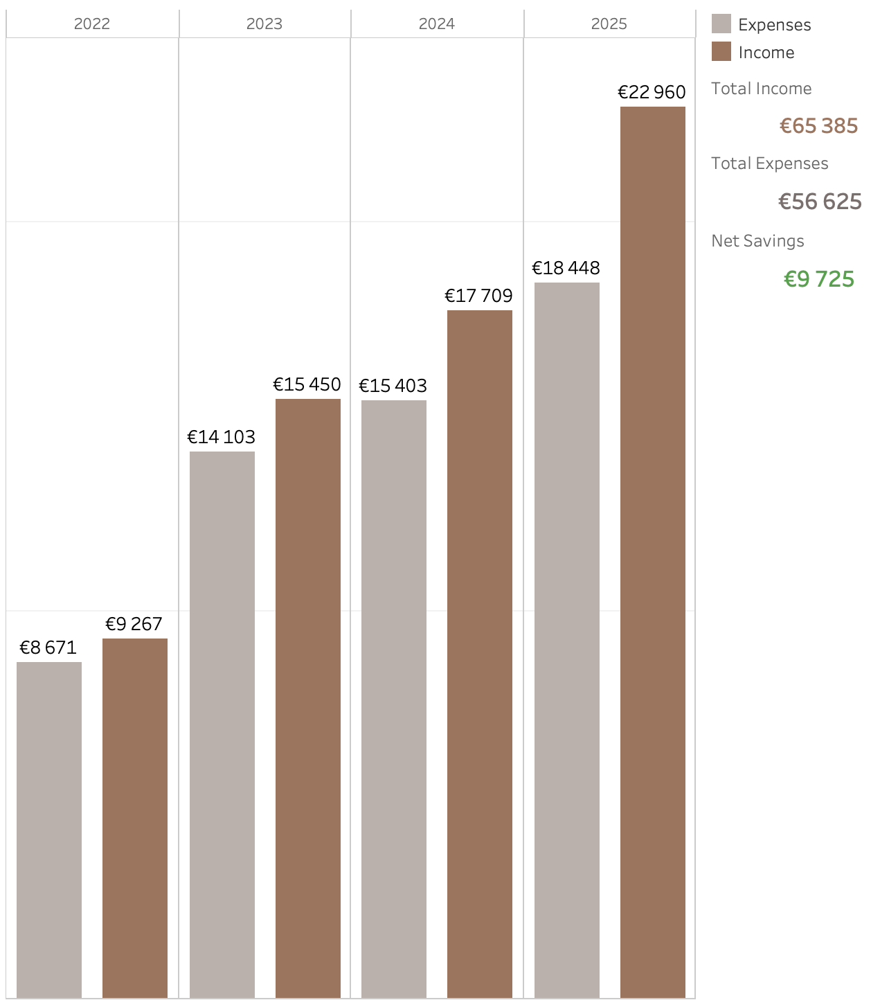
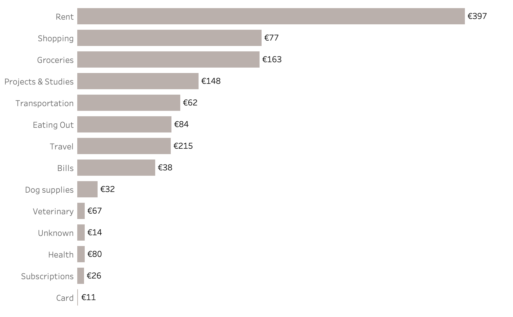
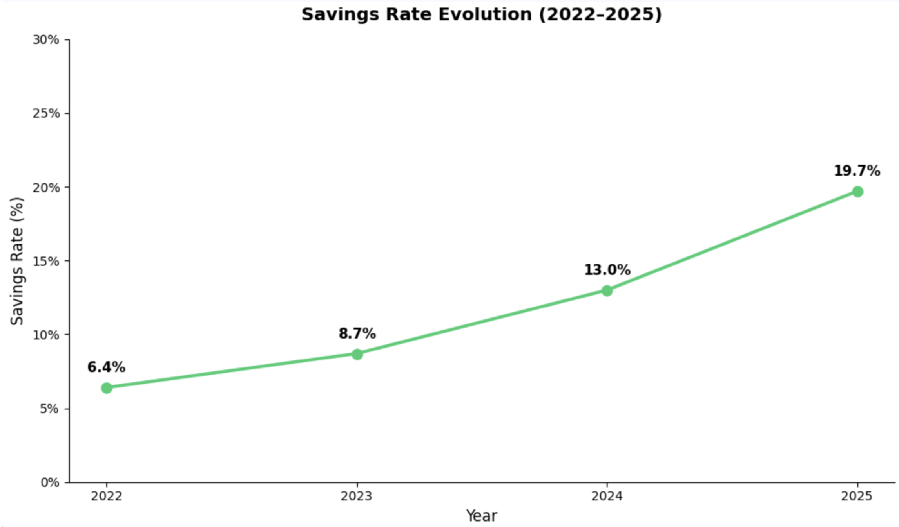

# Personal Finances Analysis (2022–2025)

## Problem Statement

This project analyses four years of personal income and expense data (2022–2025) to understand financial evolution over time, identify spending patterns, and evaluate savings performance.

**Key questions:**
- How did income and expenses evolve year over year?
- Which categories represent the largest share of spending?
- What is the savings trend over time?

> 2026 data is excluded from this analysis as the year is incomplete and would distort annual comparisons.

---

## Data

Manually recorded personal financial data collected between May 2022 and December 2025.

- Source: Personal Excel files, consolidated into a single dataset
- Two datasets: Income and Expenses
- Income records: 195 rows
- Expense records: 534 rows
- Data originally recorded in Portuguese; categories standardised to English for analysis
- Structural change in 2023 reflects international relocation from Portugal to Ireland

**Note:** 2022 includes data from May onwards only.

---

## Data Cleaning & Transformation

Performed in Python (Pandas):

- Removed trailing whitespace from month names
- Converted month column to ordered categorical for correct chronological sorting
- Standardised subcategory names (title case, removed duplicates)
- Converted Year and Amount columns to numeric types
- Renamed ambiguous category "Card" to "Bank Fees"
- Filtered out 2026 incomplete data

---

## Analysis & Visualisation

### Yearly Income vs Expenses

  

| Year | Income | Expenses | Net Savings | Savings Rate |
|------|--------|----------|-------------|--------------|
| 2022 | €9,267 | €8,671 | €596 | 6.4% |
| 2023 | €15,450 | €14,103 | €1,347 | 8.7% |
| 2024 | €17,709 | €15,403 | €2,306 | 13.0% |
| 2025 | €22,960 | €18,448 | €4,512 | 19.7% |

### Expenses by Category

  

### Savings Rate Evolution

  

### Interactive Dashboard

👉 [View Dashboard on Tableau Public](https://public.tableau.com/views/projectpersonalfinances/Finaldashboard?:language=pt-BR&:sid=&:redirect=auth&:display_count=n&:origin=viz_share_link)

---

## Key Insights

- Income grew 148% over four years, from €9,267 to €22,960.
- Expenses grew at a slower pace (113%), allowing savings to improve every year.
- Savings rate increased from 6.4% in 2022 to 19.7% in 2025.
- Rent is the largest expense category at €16,975 — 29% of total spending over four years.
- Shopping (€8,066) and Groceries (€7,981) are the second and third largest categories.
- Projects & Studies (€5,296) reflects investment in education and professional development during this period.

- Income growth accelerated significantly from 2023 onwards, coinciding with relocation from Portugal to Ireland and increased working hours. 
  This structural change is reflected in both income levels and spending patterns across categories.

---

## Tools & Technologies

- Python (Pandas, Matplotlib)
- Jupyter Notebook (Google Colab)
- Tableau Public
- Excel

---

## Next Steps

- Analyse monthly spending patterns within each year
- Build a more detailed Tableau dashboard with category filtering
- Update analysis when 2026 full year data is available

---

## Author

Gabriela Rijo
Aspiring Data Analyst | Based in Ireland
