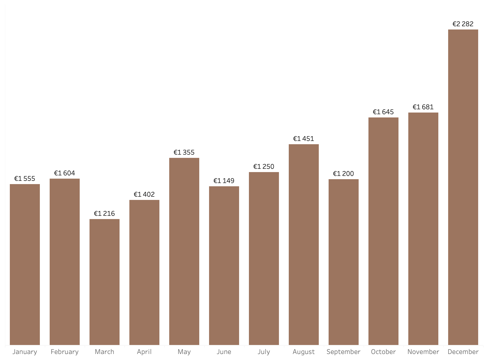

# Personal Financial Analysis (2022–2025)

## Project Overview

This project analyzes personal income and expense data from 2022 to 2025 to evaluate financial performance, spending structure, and savings evolution over time.

The objective is to transform raw financial data into meaningful insights through data cleaning, structured analysis, and interactive visualization using Tableau.

---

## Data Description

The dataset contains manually recorded personal financial data collected between 2022 and 2025. 

Key characteristics of the dataset:

- Data originally recorded in Portuguese
- Income and expense tracking performed consistently over multiple years
- Structural change observed in 2023 due to international relocation, reflected in both income and expense patterns
- 2022 includes data from May onwards
- 2026 data is excluded from analysis as it represents an incomplete year

---

## Objectives

- Analyze income growth over time  
- Compare yearly income vs expenses  
- Identify spending distribution by category  
- Evaluate savings performance  
- Build an interactive Tableau dashboard  

---

## Tools & Technologies

- Python (Pandas, NumPy)
- Jupyter Notebook
- Tableau Public
- Excel

---

## Phase 1 – Yearly Income vs Expenses (2022–2025)

  

**Key Insights:**
- Income shows consistent growth from 2022 to 2025.
- Expenses increased gradually but at a controlled rate.
- Net savings improved over time.

**2022–2025 Summary:**
- Total Income: €65,385  
- Total Expenses: €56,625  
- Net Savings: €9,725  

---

## Phase 2 – Monthly Income Trend

  

**Key Insights:**
- Income varies across months.
- Stronger income periods are visible towards the end of the year.
- December represents the highest monthly income.

---

## Phase 3 – Average Expenses by Category

  

**Key Insights:**
- Rent is the largest expense category.
- Groceries and Shopping follow as major recurring costs.
- Lifestyle-related categories show moderate impact.

---

## Interactive Dashboard

👉 **Explore the full interactive Tableau Dashboard here:**  
[View Dashboard on Tableau Public]
(https://public.tableau.com/views/projectpersonalfinances/Finaldashboard?:language=pt-BR&:sid=&:redirect=auth&:display_count=n&:origin=viz_share_link)

The interactive version allows filtering by year, category, and detailed exploration of income and expense behavior.

---

## Methodology

1. Data cleaning and preparation in Python  
2. Aggregation by year, month, and category  
3. Creation of calculated metrics (Total Income, Total Expenses, Net Savings)  
4. Visualization development in Tableau  
5. Dashboard design and layout optimization  

---

## Key Takeaways

- Income growth outpaced expense growth over time.
- Savings performance improved year-over-year.
- Rent remains the primary cost driver.
- Financial stability increased significantly by 2025.

---

## Financial Projection & Target Income Estimation

Based on the historical analysis (2022–2025), it is possible to estimate a sustainable target income aligned with:

- Fixed cost structure  
- Desired savings rate  
- Long-term financial objectives  

The analysis suggests that maintaining income growth above expense growth is critical to ensuring financial stability and consistent net savings improvement.

---

## Project Status

Completed and publicly available via Tableau Public.

---

## Author

Gabriela Rijo  
Aspiring Data Analyst  
Based in Ireland  

